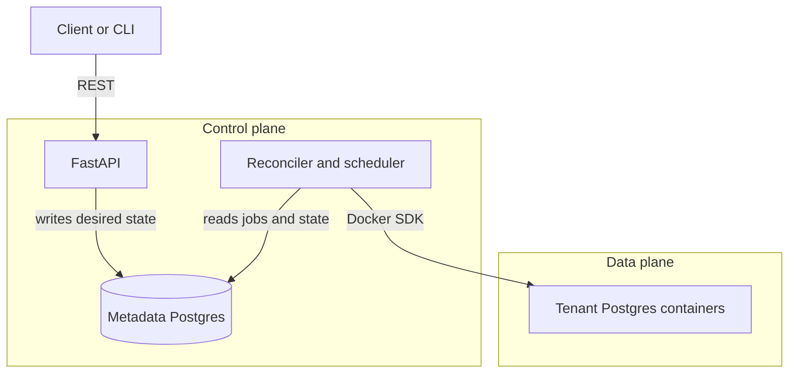
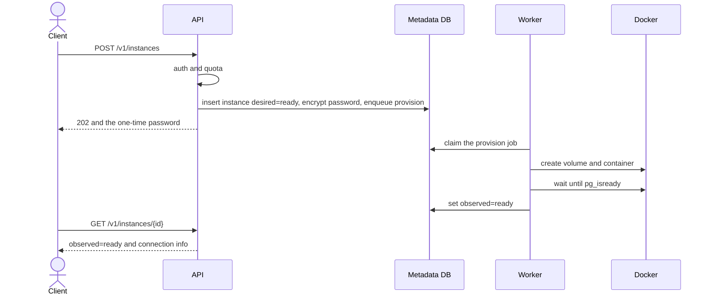
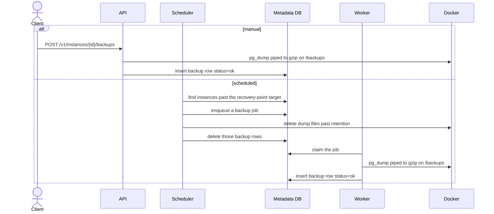

# Mini-DBaaS

Mini-DBaaS is a self-service control plane for Postgres. A FastAPI service
lets a team create, resize, patch, back up, and expire database instances.
Each instance is its own Docker container, with its own volume, port, and
credentials. Teams, roles, and quotas live in the control plane.

## Architecture

The API writes **desired state** and returns. A worker and an in-process
scheduler read that state from the metadata database and drive Docker until
**observed state** matches. A restart picks up unfinished jobs, so a crashed
provision does not leave the API holding a half-created container.



Tenant containers are labelled `mdbaas.managed=true`, bound to `127.0.0.1` on
a port from the configured range, and named from the instance id. The metadata
database is a separate Postgres and is never one of those instances.

| Path | Role |
|---|---|
| `app/api/` | HTTP: validate, authenticate, delegate |
| `app/services/` | Policy, desired state, job enqueue |
| `app/lifecycle/` | Job worker, reconciler, backups, expiry |
| `app/provisioner/` | The only code that talks to Docker |
| `cli/` | Thin HTTP client |

The split, the reconciler, and the provisioner interface are recorded in
[ARCHITECTURE.md](ARCHITECTURE.md). Decision records are indexed in
[docs/README.md](docs/README.md). State, schema, and deployment diagrams are
in [docs/diagrams.md](docs/diagrams.md).

## Create an instance

`POST /v1/instances` checks the caller and the team quota, stores an encrypted
superuser password, and enqueues a provision job. The response is `202` and
includes that password once. The worker then creates the container and waits
until Postgres accepts connections.



## Back up an instance

A manual backup runs in the request. The scheduler enqueues the same work for
any ready instance whose last successful dump is older than the recovery-point
target, then deletes dumps past the retention window. In both cases `pg_dump`
runs inside the tenant container and writes a gzip file on the shared backups
volume.



## Run

Generate a Fernet key, then start the API and the metadata database:

```bash
export MDBAAS_CREDENTIAL_ENCRYPTION_KEY=$(python -c "from cryptography.fernet import Fernet; print(Fernet.generate_key().decode())")
docker compose up --build
```

The API is published on host port **8001** (`MDBAAS_HOST_PORT` overrides it).
On first start the API logs a bootstrap admin key:

```bash
docker compose logs api | grep "bootstrap admin API key"
export MDBAAS_API_KEY=mdb_...
export MDBAAS_API_URL=http://localhost:8001
```

Interactive docs: http://localhost:8001/docs

```bash
curl -s "$MDBAAS_API_URL/health"

curl -s -X POST "$MDBAAS_API_URL/v1/teams" \
  -H "Authorization: Bearer $MDBAAS_API_KEY" -H "Content-Type: application/json" \
  -d '{"name":"acme"}'

curl -s -X POST "$MDBAAS_API_URL/v1/instances" \
  -H "Authorization: Bearer $MDBAAS_API_KEY" -H "Content-Type: application/json" \
  -d '{"team_id":"<team-id>","name":"app-db","size":"small"}'
```

The `mdbaas` CLI calls the same API. Its default URL is port 8000, so point it
at the Compose port:

```bash
python3 -m venv .venv && source .venv/bin/activate
pip install -e .
export MDBAAS_API_URL=http://localhost:8001

mdbaas health
mdbaas teams create acme
mdbaas instances create app-db --team <team-id> --size small
mdbaas instances status <instance-id>
```

## Develop

```bash
python3 -m venv .venv && source .venv/bin/activate
pip install -e ".[dev]"
pytest
```

Tests use a file-backed SQLite metadata database and a fake provisioner, so
they exercise the API, services, job queue, and reconciler without Docker.
`MDBAAS_ENABLE_SCHEDULER=false` keeps the background scheduler off.

## Configuration

Settings use the `MDBAAS_` prefix. The ones you will set first:

| Variable | Purpose |
|---|---|
| `MDBAAS_DATABASE_URL` | Control-plane Postgres |
| `MDBAAS_CREDENTIAL_ENCRYPTION_KEY` | Fernet key for stored passwords |
| `MDBAAS_PG_IMAGE_DEFAULT` | Image used when a create omits one |
| `MDBAAS_PORT_RANGE_START` / `MDBAAS_PORT_RANGE_END` | Host ports for tenant instances |

The full list is in [.env.example](.env.example).

## License

MIT. See [LICENSE](LICENSE).
