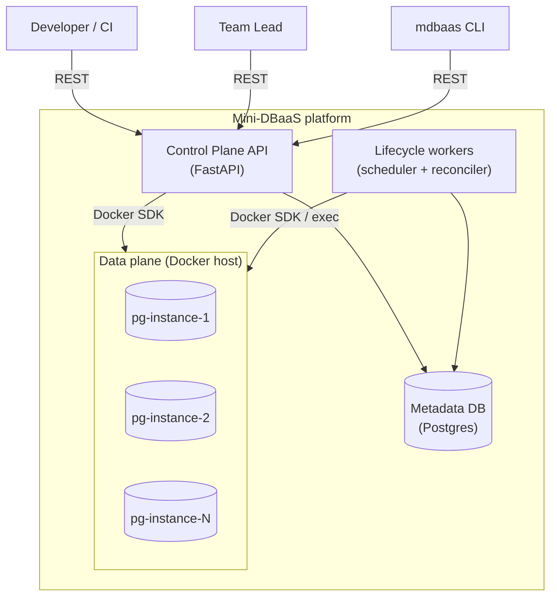
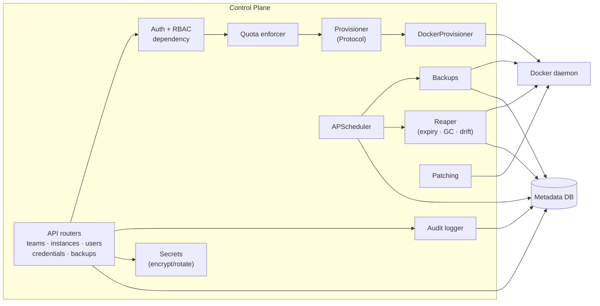
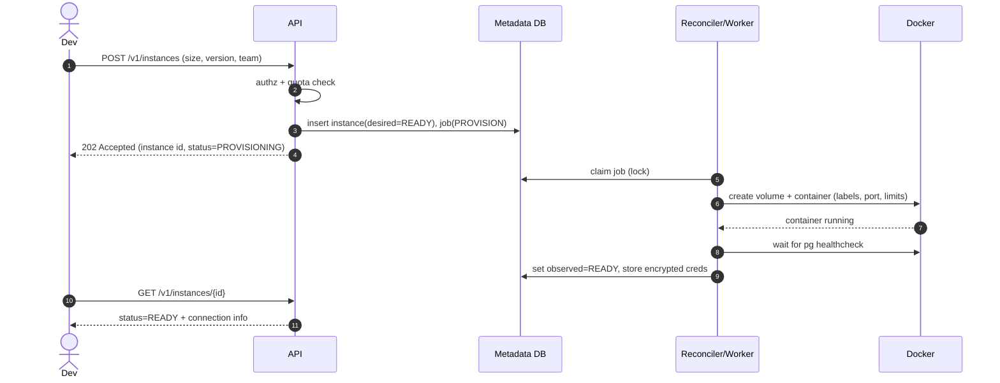
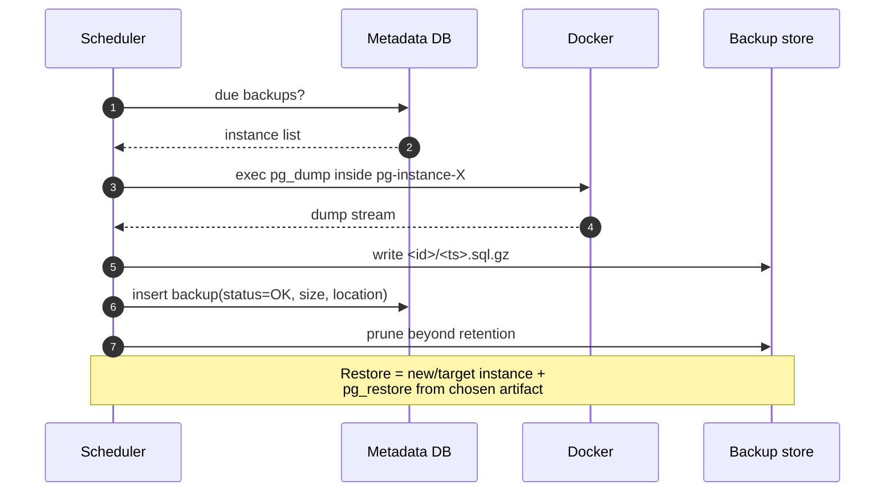
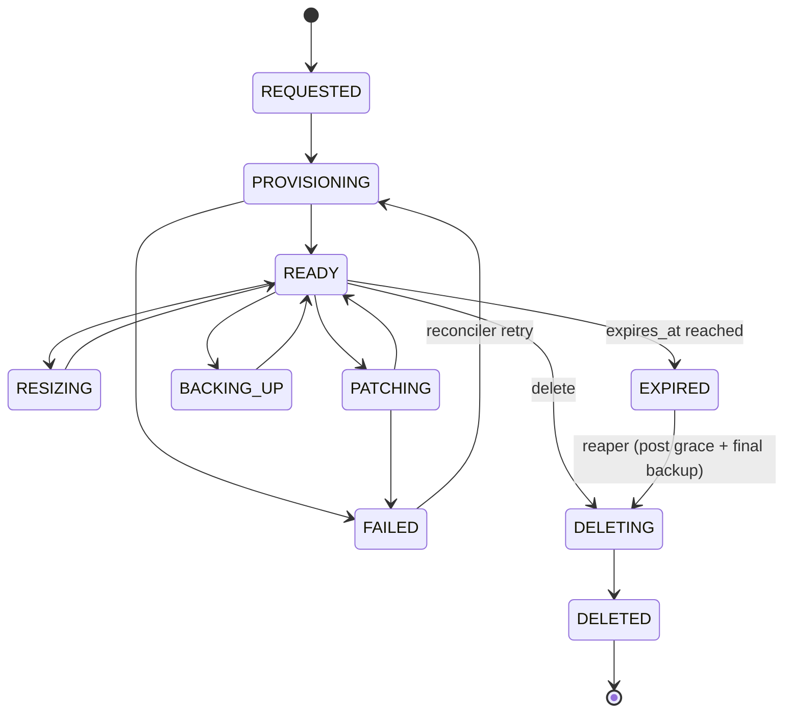
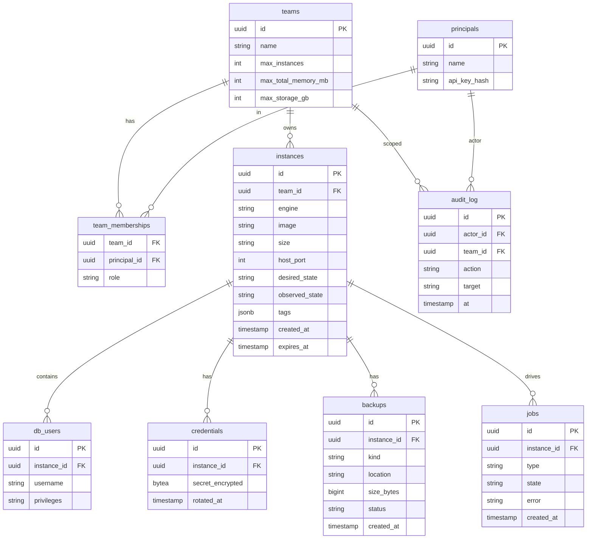
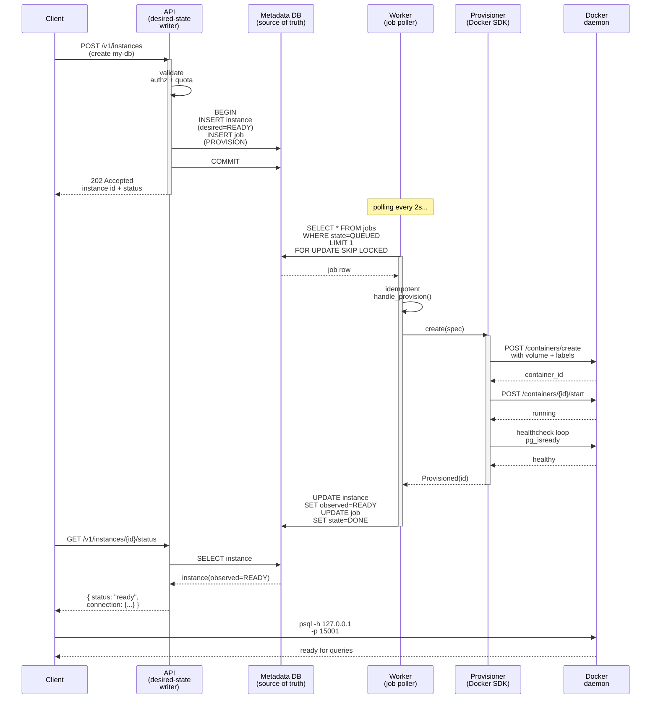
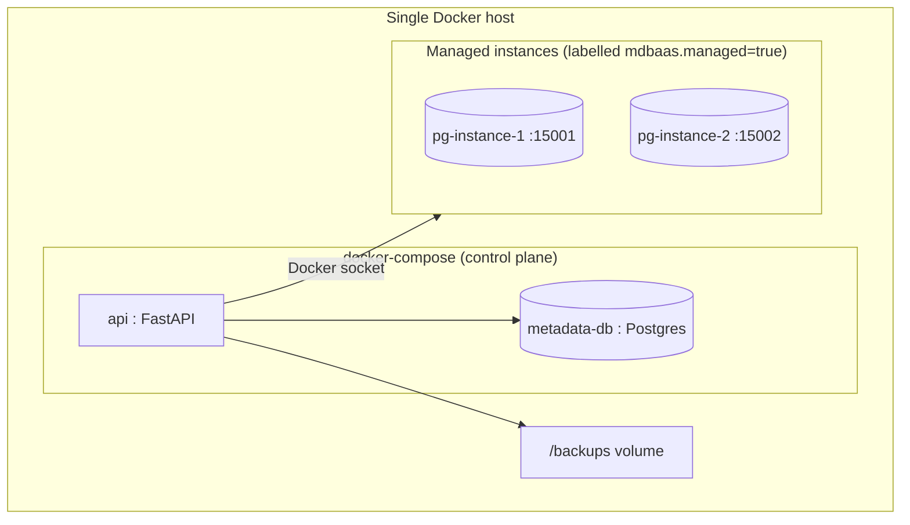

# Diagrams — Mini-DBaaS

All diagrams use [Mermaid](https://mermaid.js.org/) so they render on GitHub and
in most Markdown viewers. They are the visual companion to the
[Architecture](../ARCHITECTURE.md).

---

## 1. System context (C4 level 1)

---

## 2. Component view (C4 level 2)

---

## 3. Provisioning sequence (async)

---

## 4. Backup & restore sequence

---

## 5. Instance lifecycle state machine

---

## 6. Metadata ER model

---

## 7. Provisioning workflow (end-to-end, with desired-state reconciliation)

**Key insight:** The client gets a quick `202` response while the actual provisioning happens async. The reconciler converges `observed_state` toward `desired_state` independently, making the system resilient to crashes and enabling job retries (ADR-003).

---

## 8. Deployment (MVP, single host)

