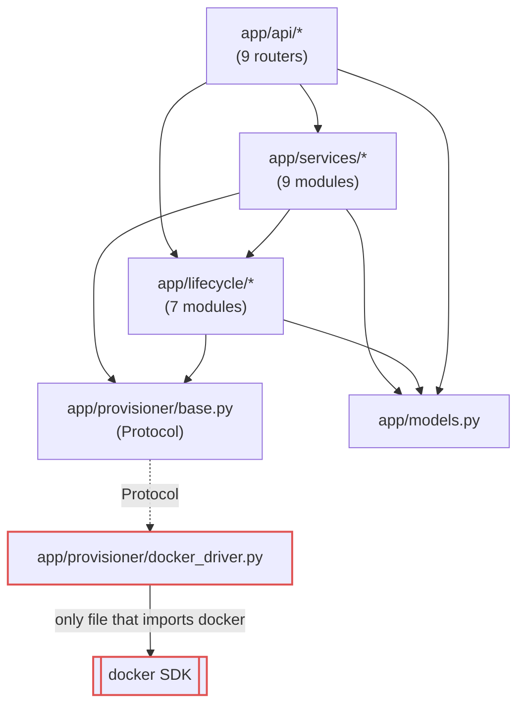
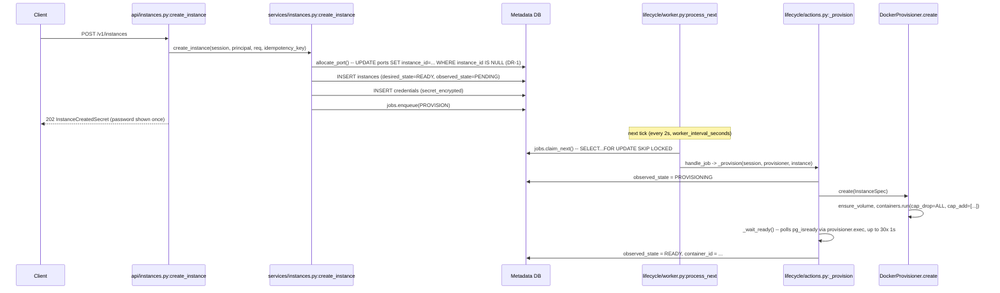
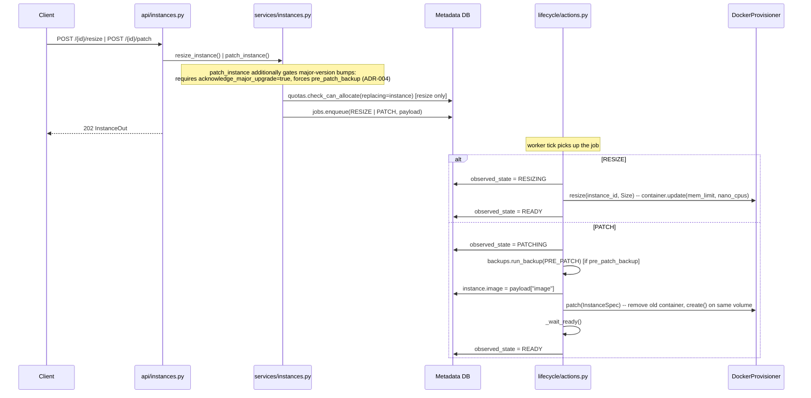
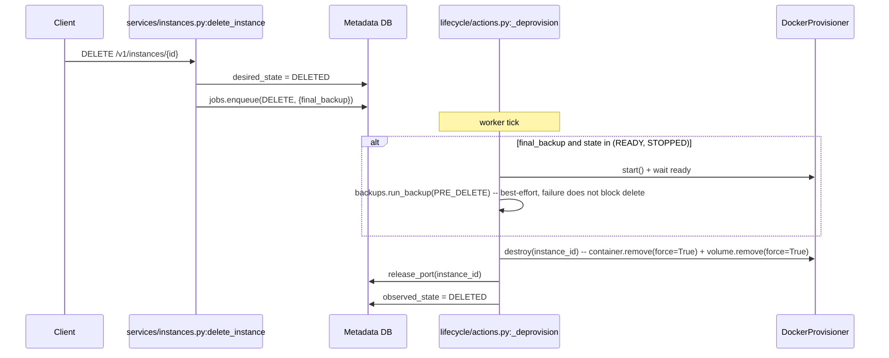
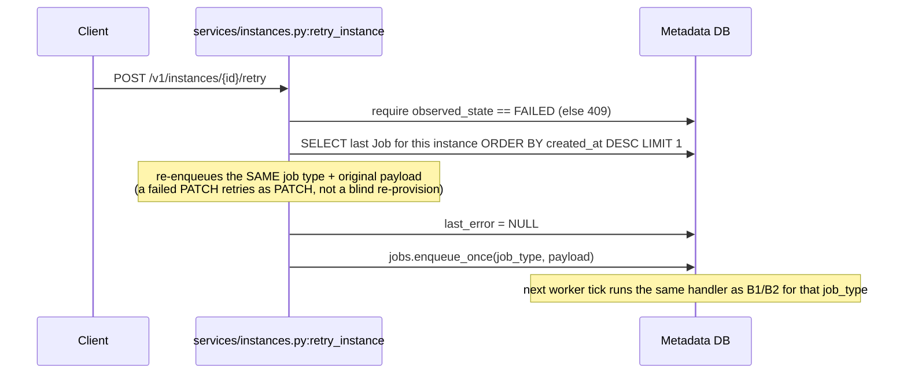
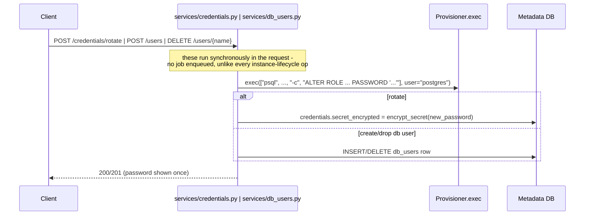
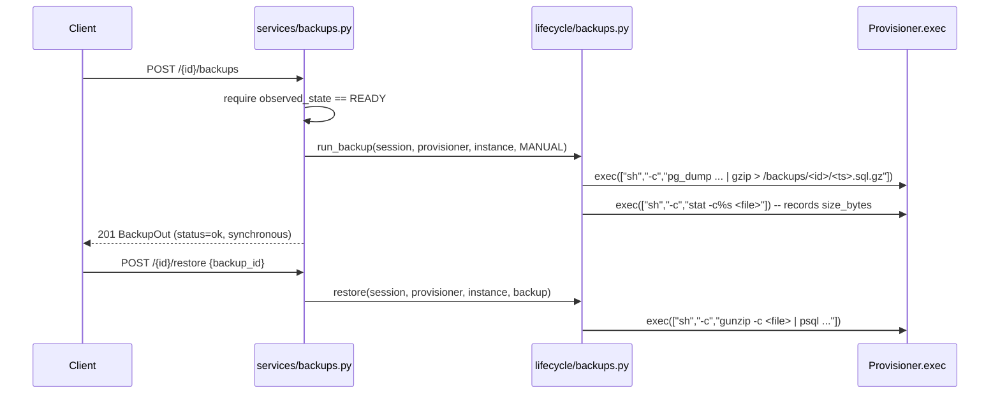
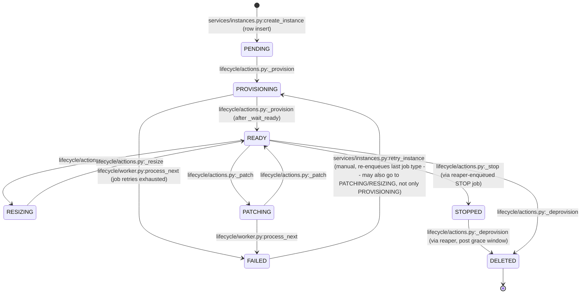
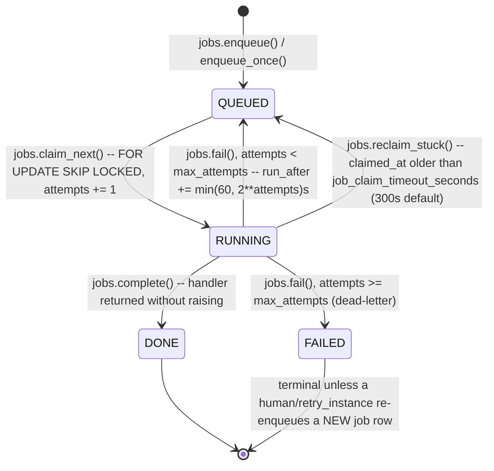

# Moving-Parts Model — Mini-DBaaS

A deterministic model of the codebase: every node/edge below was extracted by
reading the actual source (grep/read), not inferred from what a system like
this "usually" looks like. Each diagram is preceded by its **sources** — the
exact files/functions it was derived from — so it can be re-verified without
re-deriving it. This is a companion to [diagrams.md](diagrams.md) (which shows
the intended architecture) — this document shows what the code *actually does*,
function by function.

Generated 2026-07 against commit `5b2ee16`.

---

## A. Layered dependency graph

**Sources:** `grep -rn "^import docker\|^from docker" app/ cli/` (1 hit,
confirming the provisioner boundary); `app/api/__init__.py`;
imports at the top of each `app/services/*.py` and `app/lifecycle/*.py` file.



**Verified invariant:** exactly one file (`app/provisioner/docker_driver.py`)
imports the `docker` package. No `app/api/*`, `app/services/*`, or
`app/lifecycle/*` file does. The Protocol boundary (ADR-002) holds in code, not
just in the docs.

---

## B. Request → convergence sequence diagrams

**Sources:** `app/api/instances.py`, `app/services/instances.py`,
`app/lifecycle/{jobs,actions,worker}.py`, `app/provisioner/docker_driver.py`.

### B1. Create



### B2. Resize / Patch (same shape, different job type + provisioner verb)



### B3. Delete



### B4. Retry (recovers a FAILED instance)



### B5. Credential rotate / DB user create-drop (synchronous, no job queue)



### B6. Manual backup / Restore



---

## C. State machines (edges labeled with the exact function that performs them)

**Sources:** `grep -n "observed_state = \|desired_state = " app/**/*.py`
(full output above); `app/lifecycle/jobs.py`.

### C1. InstanceState (observed_state)



Note (verified, not in the original diagrams.md): there is **no automatic**
`FAILED --> *` edge. `reconciler.py` only acts when
`desired_state=READY and observed_state=READY` (missing-container drift) or
`desired_state=DELETED` (stuck delete) — `FAILED` is excluded from both
branches. The only way out of `FAILED` is the manual retry in B4. This matches
[design-review.md §2.5](design-review.md#25--drift-detection-treats-present-as-healthy--a-stopped-container-is-invisible).

### C2. JobState

**Sources:** `app/lifecycle/jobs.py` lines 54-96 exactly.



---

## D. Entity-relationship diagram (from `app/models.py` exactly)

**Sources:** `app/models.py`, every `mapped_column`/`ForeignKey` read directly.

```mermaid
erDiagram
    teams ||--o{ team_memberships : "team_id"
    principals ||--o{ team_memberships : "principal_id"
    teams ||--o{ instances : "team_id"
    instances ||--o| credentials : "instance_id (unique)"
    instances ||--o{ db_users : "instance_id"
    instances ||--o{ backups : "instance_id"
    instances ||--o{ jobs : "instance_id (nullable)"
    ports ||--o| instances : "instance_id (nullable, unique claim)"

    teams {
        string id PK
        string name UK
        int max_instances "default 10"
        int max_total_memory_mb "default 8192"
        int max_storage_gb "default 100 (soft limit, DR-8)"
    }
    principals {
        string id PK
        string name UK
        string api_key_hash "bcrypt, never reversible"
        bool is_platform_admin
    }
    team_memberships {
        string team_id PK_FK
        string principal_id PK_FK
        string role "owner|admin|member|readonly"
    }
    instances {
        string id PK
        string team_id FK
        string name
        string image
        string pg_version
        string size "small|medium|large"
        int host_port
        string desired_state
        string observed_state
        string container_id
        json tags
        string last_error
        datetime expires_at
        datetime expiry_stopped_at "DR-7 phase-1 marker"
    }
    credentials {
        string id PK
        string instance_id FK_UK
        string username "default mdbaas_admin"
        bytes secret_encrypted "Fernet"
        datetime rotated_at
    }
    db_users {
        string id PK
        string instance_id FK
        string username
        string privileges "readonly|readwrite"
    }
    backups {
        string id PK
        string instance_id FK
        string kind "scheduled|manual|pre_patch|pre_delete"
        string location
        int size_bytes
        string status "running|ok|failed"
    }
    jobs {
        string id PK
        string instance_id FK "nullable"
        string type
        string state
        json payload
        int attempts
        int max_attempts
        datetime run_after "backoff gate"
        datetime claimed_at "visibility timeout"
    }
    ports {
        int port PK
        string instance_id "nullable, unique claim (DR-1)"
        datetime allocated_at
    }
    idempotency_keys {
        string key PK
        string principal_id
        string instance_id
    }
    audit_log {
        string id PK
        string actor_id "nullable"
        string team_id "nullable"
        string action
        string target
        json detail
    }
```

---

## E. Background-loop map

**Sources:** `app/lifecycle/scheduler.py` lines 107-110, `app/config.py`
lines 49-52.

| Job id | Trigger | Default cadence | Advisory lock? | Calls |
|---|---|---|---|---|
| `worker` | interval | 2s | No — `claim_next()`'s `SKIP LOCKED` already makes multi-replica safe | `lifecycle/worker.py:drain()` → up to 50 jobs via `process_next()` |
| `reconcile` | interval | 60s | Yes — `pg_try_advisory_lock(4711001)` | `lifecycle/reconciler.py:reconcile()` |
| `reaper` | interval | 300s | Yes — `pg_try_advisory_lock(4711002)` | `lifecycle/reaper.py:sweep()` |
| `backups` | cron | hour=2 (daily) | Yes — `pg_try_advisory_lock(4711003)` | `backups.due_for_backup()` → enqueue BACKUP jobs; `backups.prune_old()` |

All four run in-process via APScheduler `BackgroundScheduler` inside
`minidbaas-api-1` (ADR-006). The advisory-lock wrapper is a no-op (always
returns held=True) on non-Postgres backends — verified in
`scheduler.py:_is_postgres()`, which is why the test suite (SQLite) doesn't
need real locking to pass.

---

## F. Findings appendix — contradictions/gaps found while deriving this model

1. **`FAILED` has no automatic recovery path** (confirmed in §C1). The
   `diagrams.md` state diagram was corrected in a prior pass to say
   "POST /retry (manual...)" — this document confirms that fix is accurate to
   the code: `reconciler.py` genuinely excludes `FAILED` from both its
   branches. This is a deliberate design choice (design-review §5.3's
   "auto-destroy is dangerous" reasoning extends to auto-retry-forever too),
   not a gap — left as manual-only, not fixed.
2. ✅ **Fixed** — Credential rotation and DB-user management are the only
   mutating instance operations that run synchronously (§B5) rather than
   through the job queue, so they never got the queue's automatic
   retry-with-backoff (DR-3). `services/pgops.py:psql()` now retries up to 3
   times with a 1s delay before giving up — see
   [design-review.md §2.7](design-review.md#27--fixed--synchronous-credentialdb-user-operations-had-no-retry-at-all).
3. ✅ **Fixed** — `reconciler.reconcile()`'s orphan-GC branch called
   `provisioner.destroy()` with no error handling, unlike every other
   destructive path. A transient failure there could roll back legitimate
   drift-repair jobs enqueued earlier in the same tick (same DB session).
   Each orphan destroy is now wrapped in its own `try/except` — see
   [design-review.md §2.6](design-review.md#26--fixed--orphan-gc-failure-could-roll-back-unrelated-drift-repair-in-the-same-tick).

Also fixed as part of the same pass, corresponding to
[design-review.md §2.5](design-review.md#25--fixed--drift-detection-treats-present-as-healthy--a-stopped-container-is-invisible):
`reconcile()` now calls `provisioner.status()` for every READY-and-present
instance and re-enqueues `PROVISION` (idempotent — restarts rather than
re-creates) if it isn't actually `RUNNING`. §C1's "no automatic FAILED
recovery" note above is unaffected — this fix converges READY instances whose
container silently stopped; it doesn't touch the FAILED state machinery.
