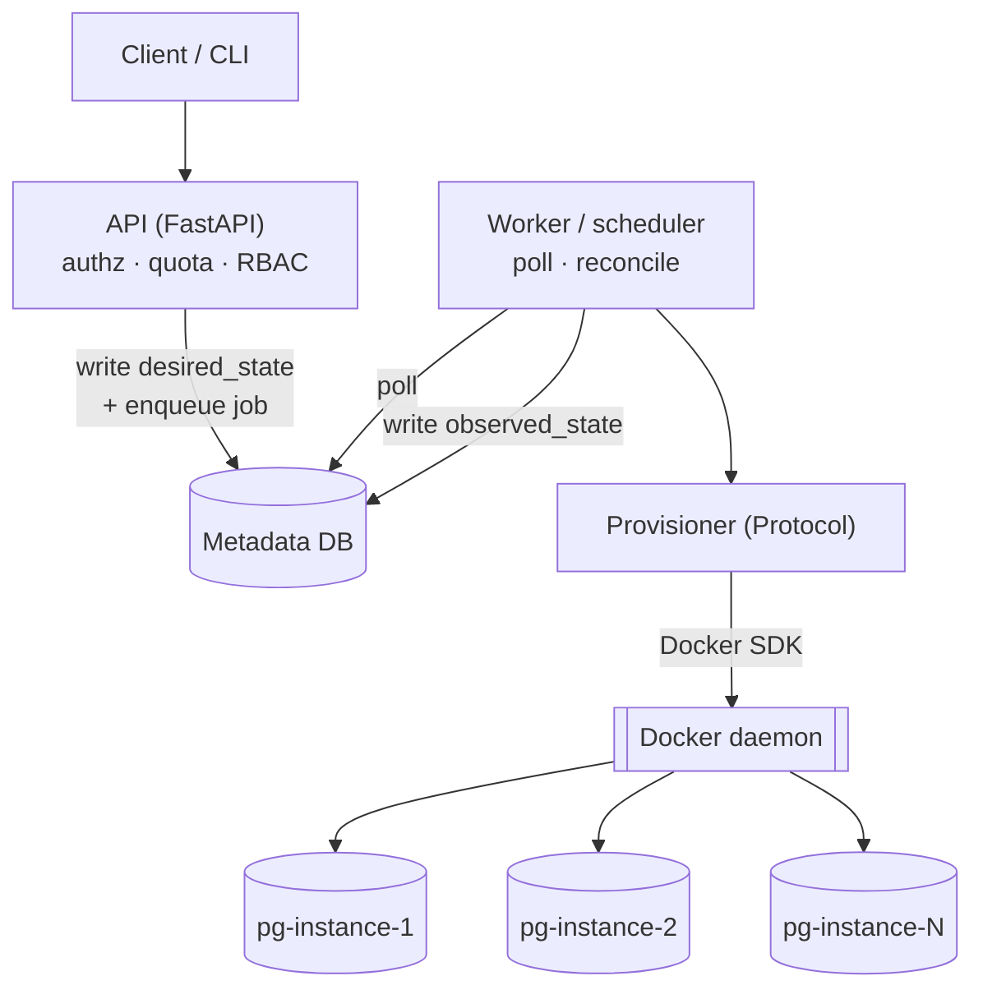

# System Design Walkthrough — Mini-DBaaS

An interview-style narrative explanation of the system: the requirements that
shaped it, the high-level design, and a deep dive into the decisions worth
defending out loud. Where a decision already has its own ADR or a bug already
has its own design-review entry, this doc links to it rather than repeating it
— the point here is the *story*, not a third copy of the detail.

Use this as onboarding material or interview prep, not as the source of truth
for any individual decision — [ARCHITECTURE.md](../ARCHITECTURE.md) and the
[ADRs](adr/) are that.

---

## 1. Clarify the requirements first

**Functional:** self-service create/resize/patch/delete of Postgres instances,
managed DB roles, credential rotation, backups/restore, and multi-tenancy with
quotas. Full list in [PRD.md](PRD.md).

**Non-functional — these are the ones that actually drive the design:**
- Provisioned databases must keep serving traffic even if the control plane
  itself is down or being redeployed.
- No data loss, no double-provisioning, no port collisions under concurrent
  requests.
- Single-host MVP, ≤~50 instances (NFR-4 in [PRD.md](PRD.md)) — an explicit
  scale constraint that licenses some intentionally cheap choices later (§7).

That last constraint is the kind of thing you say out loud in an interview:
*given the scale, I'm not reaching for Kafka or Kubernetes — here's what I'd
do instead, and here's the seam I'd leave to swap it in later.*

## 2. High-level design

The one decision everything else hangs off: **split the control plane from
the data plane** — [ADR-001](adr/ADR-001-control-plane-data-plane-split.md).

- **Control plane** = the API + its own metadata Postgres + a background
  worker/scheduler. It owns *intent*, never live tenant data.
- **Data plane** = the actual tenant Postgres containers. Disposable, but
  their data lives in a Docker volume independent of the container's lifecycle.

The API never talks to Docker synchronously. `POST /instances` validates,
checks quota, writes a row (`desired_state=READY`) and a job to the metadata
DB, and returns `202` in milliseconds. A worker polls that job table, does the
slow container work, and writes `observed_state` back — the same
"desired state vs. observed state, converged by a controller" pattern
Kubernetes uses ([ADR-003](adr/ADR-003-desired-state-reconciler.md)). I didn't
build a queue product, I used Postgres as one
(`SELECT ... FOR UPDATE SKIP LOCKED`), which is a completely standard, boring,
load-bearing pattern once you have a relational DB anyway.

**Why this split matters, concretely:** if the API process crashes, or you're
mid-deploy, every already-provisioned database keeps answering `psql`
connections — because nothing about serving traffic depends on the control
plane being up. That's the single sentence I'd want to land in an interview:
*reliability of the data path is decoupled from reliability of the control
path.*

## 3. Deep dive — the provisioner boundary

Rather than sprinkling Docker SDK calls through business logic, there's one
`Provisioner` Protocol (`create/destroy/resize/patch/status/exec/list_managed`)
and exactly one implementation today (`DockerProvisioner`) — full rationale in
[ADR-002](adr/ADR-002-provisioner-driver-abstraction.md). Every other line of
code — API, services, the reconciler — only knows about that interface.

Two payoffs, and I'd name both:
- **A Kubernetes backend is additive, not a rewrite** — the same five verbs
  map onto a StatefulSet + PVC + Service.
- **The whole test suite runs without Docker** — a `FakeProvisioner`
  implementing the same Protocol lets you test job-queue races, RBAC, and
  quota logic in-memory (`tests/fakes.py`). I verified this boundary holds by
  literally grepping for `import docker` across the repo — exactly one file
  imports it (confirmed in [moving-parts-model.md §A](moving-parts-model.md#a-layered-dependency-graph)).
  That's the kind of invariant you want to be able to assert, not just hope for.

## 4. Deep dive — the data model & multi-tenancy

Full ER diagram in [moving-parts-model.md §D](moving-parts-model.md#d-entity-relationship-diagram-from-appmodelspy-exactly).
The decisions worth explaining out loud:

- `Team` owns `Instance`s (1:N); every instance is quota-checked *before*
  anything is provisioned, not after — reject with `409`, leave no orphaned
  container behind (BRD BR-2).
- `TeamMembership` + a role enum (owner/admin/member/readonly) gives RBAC
  without a separate auth service.
- `Instance` carries **two** state columns — `desired_state` and
  `observed_state` — never one. That split is the whole reconciler pattern;
  collapsing it into a single "status" column is the mistake that makes a
  system un-reconcilable.
- `Credential` stores a Fernet-encrypted secret, never plaintext, revealed
  exactly once at creation. `Principal.api_key_hash` is bcrypt instead —
  because a DB password must be *recoverable* (the platform re-uses it for
  rotation and managed operations) while an API key only ever needs to be
  *verified*. Two different secrets, two deliberately different crypto
  choices ([ADR-005](adr/ADR-005-secrets-encrypted-in-metadata-db.md)) — worth
  calling out explicitly, it's a common interview probe ("would you encrypt or
  hash this?").
- `Port` is a pre-seeded table, not "pick a free int in application memory."
  Allocation is `UPDATE ports SET instance_id=... WHERE instance_id IS NULL
  RETURNING port` under row-locking
  ([ADR-007](adr/ADR-007-port-per-instance-connectivity.md)) — closes the
  classic TOCTOU race where two concurrent creates pick the same port.

## 5. Deep dive — concurrency bugs I had to specifically design against

This is usually the part of the interview that separates "drew boxes" from
"actually thought about failure." Full detail in
[design-review.md §2](design-review.md#2-correctness--concurrency) and
[moving-parts-model.md §C](moving-parts-model.md#c-state-machines-edges-labeled-with-the-exact-function-that-performs-them):

- **Two workers can't double-process a job** — `FOR UPDATE SKIP LOCKED` on
  claim, so a second poller just skips it and grabs the next one. No
  distributed lock service needed.
- **A crashed worker doesn't lose the job** — `claimed_at` plus a visibility
  timeout means an unfinished job gets reclaimed and retried, with exponential
  backoff, and a terminal dead-letter state after N attempts for a human to
  look at.
- **The reconciler must never resurrect something the user just deleted.** A
  naive reconciler that says "recreate anything missing" would race a real
  in-flight delete and bring a database back from the dead. The fix: the
  reconciler only ever acts on `desired_state`, never on presence alone —
  `desired=DELETED` means "ensure absent," full stop, regardless of what it
  currently sees.
- **"The container exists" isn't the same as "the container is healthy."** I
  actually shipped this bug and found it live: something stopped a container
  outside the platform, and because the reconciler's ground-truth listing
  intentionally includes stopped containers (it has to, for orphan cleanup and
  for the "intentionally stopped" TTL-expiry state), a silently-stopped
  container looked identical to a healthy one forever. Fixed in
  [design-review.md §2.5](design-review.md#25--fixed--drift-detection-treats-present-as-healthy--a-stopped-container-is-invisible):
  check `status() == RUNNING`, not just presence, for anything claiming to be
  `READY`.

## 6. Deep dive — backups and patching

`pg_dump` runs *inside* the tenant container via `docker exec`, streaming
straight to a shared volume — that avoids proxying gigabytes of dump data
through the control-plane process, and sidesteps client/server version skew
since you're always using that instance's own binaries.

"Patch" is a container image swap on the *same* volume, not a migration —
correct because Postgres data files are compatible across minor versions
([ADR-004](adr/ADR-004-patch-via-image-swap.md)). Major version bumps are
explicitly gated behind a caller acknowledgment plus a forced pre-patch
backup, because the on-disk format genuinely isn't compatible across majors
and an image swap alone would just fail to start.

## 7. What I'd flag as deliberate MVP corners, not oversights

Every one of these is a "here's what I'd do differently at 10x scale" answer,
not a bug — full list with fix sketches in
[design-review.md §7](design-review.md#7-prioritized-improvement-roadmap):

- **Port-per-instance** — fine for ≤50 instances on one host; doesn't scale
  past a finite range and has no TLS. At scale: a shared pgbouncer/SNI proxy
  terminating TLS and routing by hostname.
- **Storage quotas are soft** — the default Docker volume driver has no size
  cap, so `max_storage_gb` is honest-but-unenforced today. Real enforcement
  needs XFS/ZFS quotas or per-instance loopback volumes.
- **Backups on the same host as the data** — that's a copy, not a backup,
  until it's pushed to S3/off-host storage.
- **One shared Docker daemon** = one shared security boundary across tenants.
  Real isolation is per-team networks + gVisor/Kata or VM-per-tenant.
- **In-process scheduler** — a single Postgres advisory lock keeps two API
  replicas from double-firing backups
  ([ADR-006](adr/ADR-006-in-process-scheduler.md)), but if that one process is
  down, schedules just don't fire. Acceptable for one replica; the real answer
  is a durable external worker.

## 8. How I'd extend it

Kubernetes provisioner behind the existing Protocol (cheap, by design — §3); a
second driver for MySQL to prove the abstraction generalizes past Postgres;
read replicas / HA for the tenant databases themselves, which is the one thing
this design explicitly punts on for every tenant DB today.
